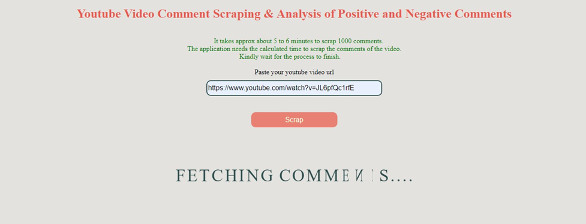
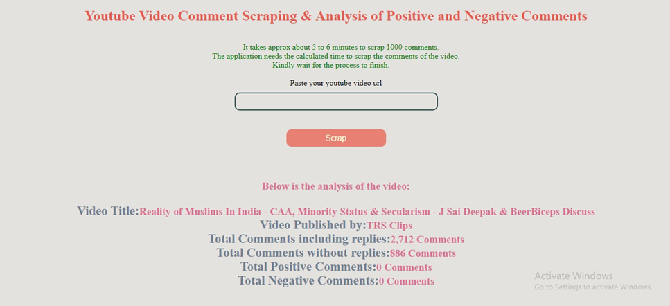
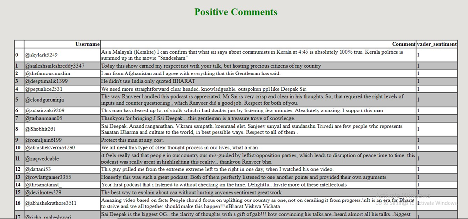
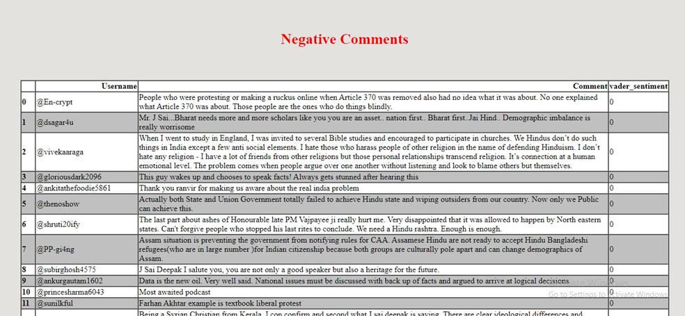

# YouTube Sentiment Analysis Web Application

<div style="background-color: white; padding: 10px; display: inline-block;">
     &nbsp; 
</div>

This project allows users to analyze YouTube video comments for sentiment analysis (positive and negative sentiments) through a Flask-based web application.

### Key Features:
- **Web Scraping**: Extract YouTube video details and comments using Python-based scraping.
- **Sentiment Analysis**: Analyze YouTube comments using a custom-built sentiment analysis model.
- **Dynamic Visualization**: Display results such as positive and negative comment statistics in a user-friendly format.
- **File Management**: Automatic deletion of temporary files after processing.

### Tech Stack:
- **Backend**: Flask for the web framework.
- **Frontend**: HTML, CSS, Jinja2 for dynamic templates.
- **Data Analysis**: Pandas for handling CSV files and generating insights.

### API Integration:
- Sentiment analysis is powered by a custom logic that outputs CSV files for both positive and negative comments.  

### Current Build:
The application is hosted locally and can be accessed via Flask's development server.

---

## Outputs:
### Example Dashboard


### Sentiment Analysis Results



---

## Usage Instructions:
1. Clone this repository:
   ```bash
   git clone https://github.com/TejaTadepalli/YouTubeSentimentAnalysis.git
   cd YouTubeSentimentAnalysis
   ```

2. Install dependencies:
    
    Run the following command to install the required Python packages:
    ```bash
    pip install flask pandas selenium nltk
    ```
    

3. Run the application:
   ```bash
   python main.py
   ```

4. Access the application at:
   ```
   http://127.0.0.1:5000/
   ```

5. **Analyze YouTube Comments**:
   - Enter a valid YouTube video URL.
   - Click the submit button to process and view results.

---

## Notes:
- Browser Compatibility:
This application uses ChromeDriver for web scraping, which works with the Chrome browser. For other browsers, you will need to download their respective drivers (e.g., GeckoDriver for Firefox, EdgeDriver for Microsoft Edge) and configure the application accordingly.
---